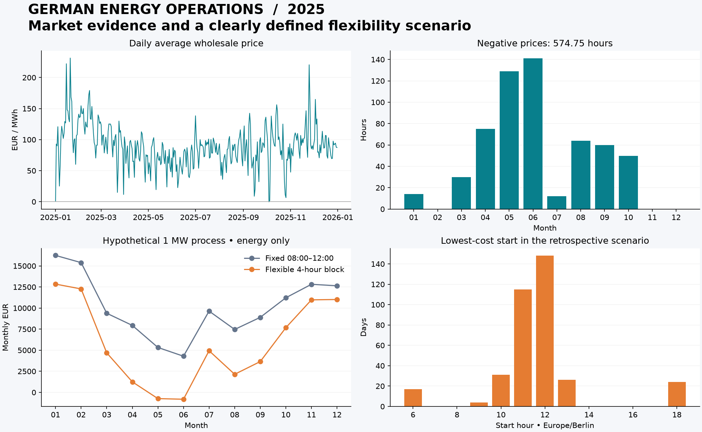

# German Energy Operations Analytics

**A reproducible Python + SQL + dbt project that connects data quality to an operational decision.**

> For a process that must run for four consecutive hours, how much historical wholesale-energy cost difference could a flexible start time offer—and what assumptions could invalidate it?



Built for an independent analytics portfolio by **Muhammad Umair Sarwar**. Uses real, openly licensed 2025 data; no private employer or customer data. **Scenario outputs are not achieved business savings.**

## Start here

- **Business reader:** [Executive decision memo](reports/executive_summary.md)
- **Technical reviewer:** [SQL scheduling logic](dbt/models/marts/mart_schedule.sql), [data contracts](src/energy_ops/normalize.py), [tests](tests/)
- **Reproduce:** follow the five commands below; the source snapshot is included and the analysis runs offline
- **Learn and explain:** [Interview walkthrough](docs/interview_walkthrough.md)

## Findings from the included snapshot

| Measured market fact | 2025 result |
|---|---:|
| Aligned quarter-hour intervals | 35,040 |
| Time-weighted DE-LU day-ahead price | €89.32/MWh |
| Duration of negative prices | 574.75 hours |
| Wind-plus-solar generation / German load | 43.2% |

The wind/solar ratio is not the total renewable share or a site's electricity mix.

For a **hypothetical constant 1 MW process**, four consecutive hours every calendar day, starting between **06:00 and 18:00** instead of a fixed **08:00** start:

| Retrospective energy-only scenario | Result |
|---|---:|
| Eligible days | 365 |
| Baseline cost | €121,261.79 |
| Flexible schedule cost | €69,896.86 |
| Gross difference | €51,364.94 (42.4%) |

These figures exclude tariffs, taxes, start/stop costs, staffing, throughput and other real constraints. The historical download does not preserve original publication times or revisions, so this is a price-curve benchmark, not a verified live backtest. The model uses no realized generation/load to choose operating times.

**Decision:** the scenario motivates evaluating a constrained shadow pilot, not claiming savings. The dashboard lets a reviewer vary process power and an assumed per-day rescheduling cost to see how fragile the gross difference may be.

## What makes this technically useful

- **Interval contracts:** correctly handles the 1 October 2025 transition from hourly to 15-minute prices.
- **Timezone integrity:** UTC joins, Europe/Berlin operating dates, and tested 23/25-hour days.
- **Analytics engineering:** six dbt models, a date dimension, a quarter-hour fact and three business marts, with generated lineage/catalog documentation.
- **Quality assurance:** 20 dbt data tests and 24 Python/dashboard tests passed locally. Checksums, missingness, duplicates, units and cost reconciliation are explicit.
- **SQL decision logic:** CTEs, joins, rolling windows, eligible-candidate validation and deterministic minimum-cost selection.
- **Reproducibility:** licensed source snapshot, source URLs/hashes, dependency lock, offline rebuild and GitHub Actions configuration.
- **Communication:** Streamlit dashboard, CSV exports, executive memo and interview study guide.

## Run locally

Python **3.12** is the tested environment. No paid cloud account or API key is required.

```bash
python -m venv .venv
# macOS/Linux:
source .venv/bin/activate
# Windows PowerShell instead: .venv\Scripts\Activate.ps1
python -m pip install -r requirements-lock.txt
python -m pip install --no-deps -e .
python -m energy_ops.pipeline
python -m pytest -q
python -m streamlit run app.py
```

Run from the repository root. The first installation needs internet access; subsequent pipeline runs use the included snapshot without network downloads. `pipeline` rebuilds raw tables, runs `dbt build` (including quality gates), generates dbt docs, and exports reports. It exits on a failed test before exporting new reports. Old reports can remain after a failed run; inspect the exit status.

Refresh data **only when intended**:

```bash
python -m energy_ops.ingest --refresh
python -m energy_ops.pipeline
```

For dbt commands directly from the repository root, set `ENERGY_DB_PATH` to the absolute `warehouse/energy.duckdb` path and pass `--project-dir dbt --profiles-dir dbt`. The pipeline handles this automatically. Generated lineage documentation is in `dbt/target/`; serve it using `dbt docs serve --project-dir dbt --profiles-dir dbt` after setting the same environment variable.

## Architecture


| Location | Purpose |
|---|---|
| `src/energy_ops/` | Download/snapshot, interval contracts, pipeline and report generation |
| `dbt/models/staging/` | Expected time spine and missingness-preserving source joins |
| `dbt/models/marts/` | Date dimension, quarter-hour fact, daily KPIs, schedule and quality |
| `dbt/tests/` | Full-year coverage, DST, units and cost reconciliation |
| `tests/` | Synthetic edge cases, direct SQL fixtures and dashboard interactions |
| `data/` | Reduced compressed source snapshot, attribution and provenance |
| `reports/` | Measured metrics, CSV marts, overview graphic and decision memo |
| `docs/` | Methodology, career rationale and interview walkthrough |
| `.github/workflows/ci.yml` | Offline-data build and tests on pushes/PRs |

## Metric contract

- Quarter-hour energy: `MW × 0.25 h = MWh`.
- Scenario cost: `EUR/MWh × process MW × 0.25 h`.
- Average price: time-weighted over observed intervals; raw source row averages would overweight the quarter-hour era.
- Negative-price duration: negative quarters × 0.25 hours, not number of raw source records.
- Wind/solar ratio: ratio of energy sums on complete intervals, not average of ratios.
- Incomplete operating window: excluded; missing values never become zero or carry forward across gaps.
- Equal-cost schedules: earliest valid start. Gross flexible cost cannot exceed baseline because baseline is one candidate.

Read the [methodology](docs/methodology.md) before interpreting results.

## Scope and next steps

This repository implements local DuckDB/dbt and Streamlit. It does **not** claim Power BI, Airflow, Snowflake or production-cloud deployment. Power BI semantic modelling and a more realistic operating calendar are useful next extensions. The year and market-resolution boundary are deliberately fixed to 2025; changing the year requires updating and testing that contract.

[Career research](docs/career_research.md) explains why the project complements the existing retail, churn and weather portfolio. Employer examples are skill signals, not guaranteed job matches. AI assistance was used in development; the walkthrough supports hands-on learning and honest interview preparation.

## Sources and licences

Data: [Energy-Charts.info](https://api.energy-charts.info/), with prices credited to **Bundesnetzagentur / SMARD.de**. [CC BY 4.0](https://creativecommons.org/licenses/by/4.0/). See [data notes](data/README.md) for transformations and attribution, and [provenance](data/provenance.json) for exact URLs and hashes. Code: [MIT](LICENSE).

Author: [Muhammad Umair Sarwar](https://github.com/MUmairSarwar) · [LinkedIn](https://www.linkedin.com/in/muhammad-umair-sarwar/)
